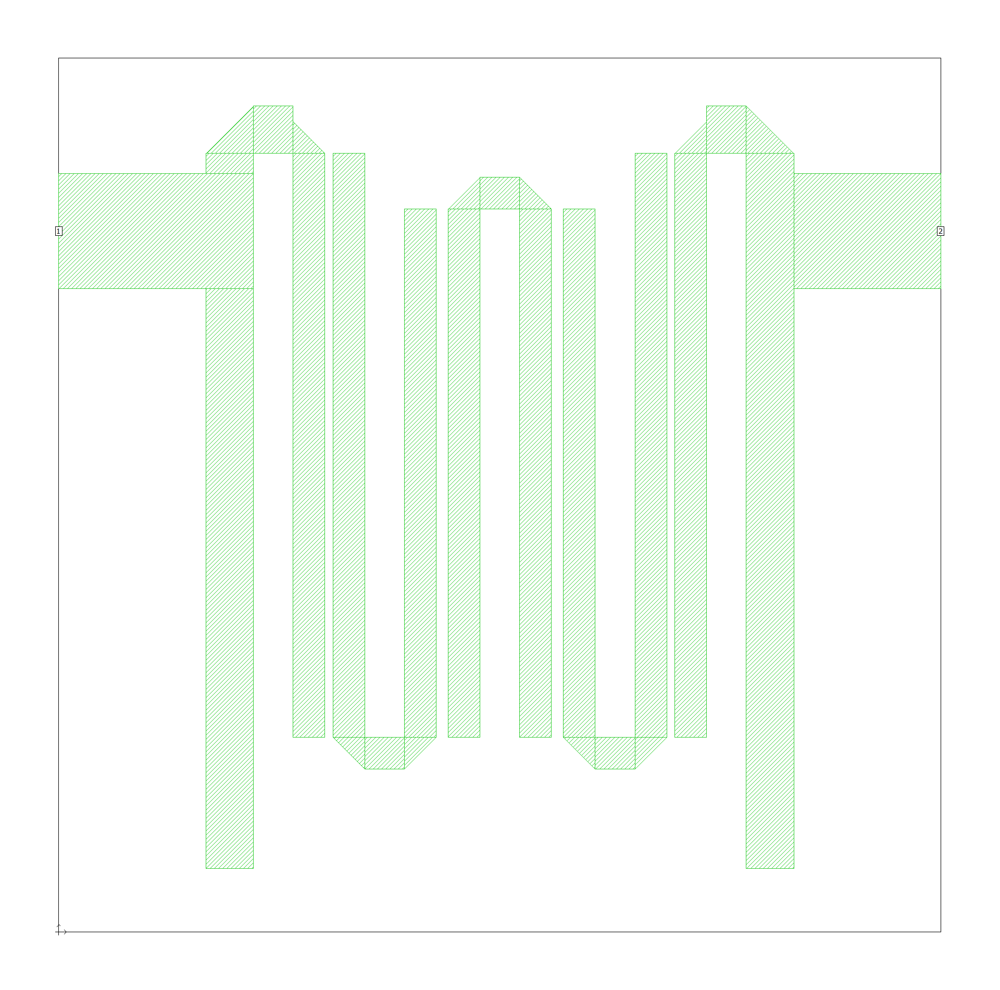
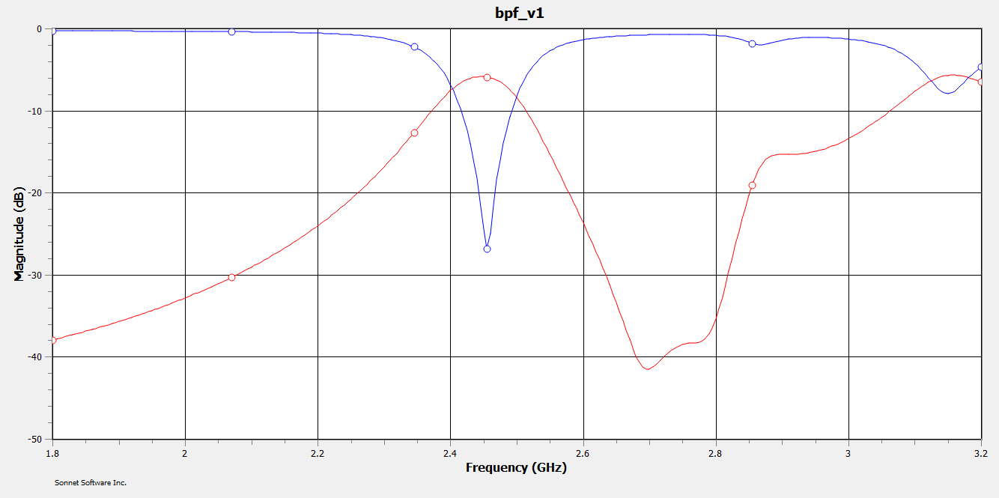

# 2.4 GHz Hairpin Bandpass Filter — FR4 Microstrip

A 5-pole Chebyshev hairpin bandpass filter designed for the 2.4 GHz ISM band on standard FR4 substrate, following the methodology of Brady (2002). The full design flow from prototype theory through ADS circuit optimization to Sonnet planar EM simulation is documented here.



## Specifications

| Parameter | Target | Simulated |
|---|---|---|
| Centre frequency | 2.4 GHz | 2.455 GHz |
| Filter type | Chebyshev | Chebyshev |
| Filter order | 5 poles | 5 poles |
| In-band ripple | 0.5 dB | |
| Fractional BW | 10% (240 MHz) | ~8.2% (~200 MHz) |
| Peak insertion loss | < 6 dB | 5.9 dB |
| Return loss at f0 | > 15 dB | 27.6 dB |
| Stopband rejection at 2.7 GHz | > 30 dB | > 40 dB |
| Substrate | FR4 | FR4 |
| Substrate thickness | 1.57 mm | 1.57 mm |
| εr | 4.4 | 4.4 |
| tan δ | ~0.02 | ~0.02 |
| Minimum feature size | 0.2 mm | 0.1 mm (outer gaps) |



## Repository Structure

```
/
├── ADS/
│   ├── half_filter_v2/          # Half-filter schematic cell
│   ├── full_filter_optim/       # Back-to-back optimization schematic
│   └── MyFirstWorkspace_lib/    # ADS library
├── Sonnet/
│   └── BPF.son                  # Sonnet EM project file
├── docs/
│   └── ALL_xx-TIE-xxxx.pdf      # Project report (IEEE format)
└── README.md
```

## Tools

ADS (Keysight Advanced Design System), university license, for schematic entry, LineCalc substrate calculation, and circuit-level optimization. Sonnet Lite 17.56 for planar EM simulation and verification.

## Status

EM simulation complete. Layout cleared for PCB fabrication with minimum feature size 0.1 mm on outer coupling gaps. Post-fabrication VNA measurement (SOLT calibration, S11 and S21) will confirm simulation accuracy. A second layout iteration may be needed to correct the 55 MHz center frequency offset introduced by junction discontinuities not fully captured in the circuit model.

## References

G. L. Matthaei, L. Young, and E. M. T. Jones, Microwave Filters, Impedance-Matching Networks, and Coupling Structures. Artech House, 1980.

D. M. Pozar, Microwave Engineering, 4th ed. Wiley, 2011.

J.-S. Hong and M. J. Lancaster, Microstrip Filters for RF/Microwave Applications. Wiley, 2001.

D. Brady, "The Design, Fabrication and Measurement of Microstrip Filter and Coupler Circuits," High Frequency Electronics, July 2002.
